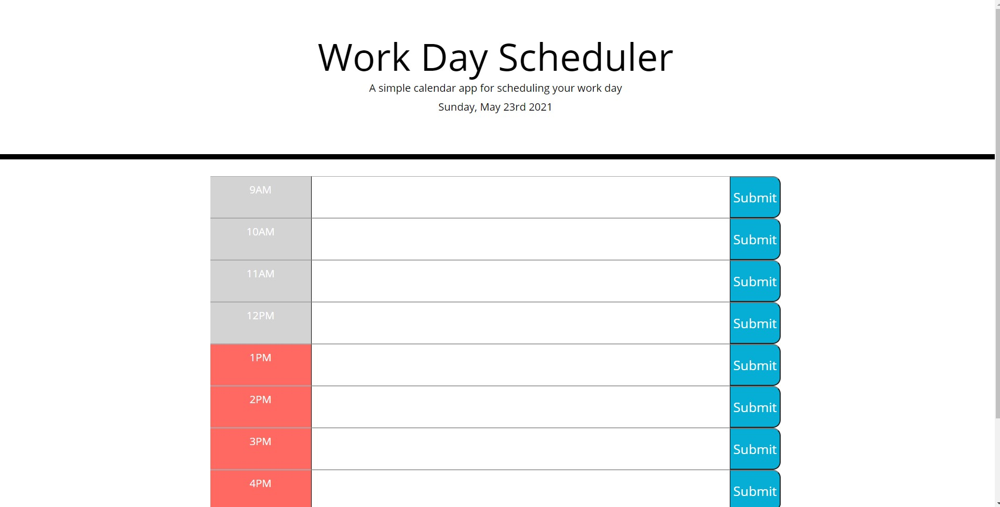

# work-day-planner
1. [ Description. ](#description)
2. [ Web Address. ](#web-address)

## 1. Description

### This is a Day planner created with Jquery, it uses CSS, and moment.js to capture time.

This application is to schedule your day. Goes from 9AM to 5 PM. 

Desktop screen:

## 2. How to Get There

### Open your web browser and enter the following web address to access.

https://jaimevilches87.github.io/work-day-planner/